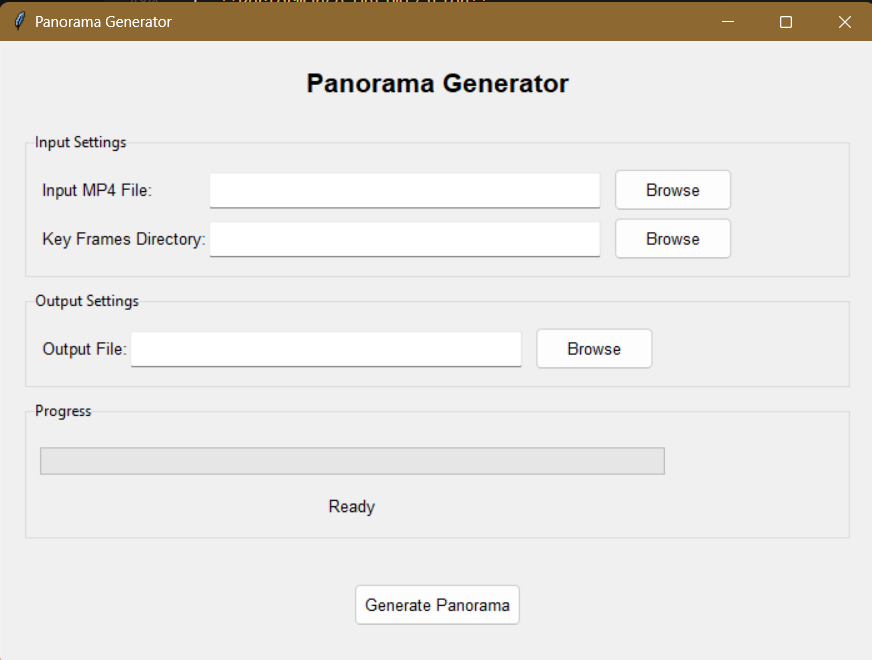

# Panorama Generator Project Report

This submission is for CourseWork1 of Computer Vision (COMP3065 UNNC) (SPC1 24-25), authored by Sihan Tian, with student ID 20127063. The example videos used for testing exceeded the GitHub maximum limit of 100MB. I have stored them together in OneDrive:
[https://nottinghamedu1-my.sharepoint.com/:f:/g/personal/scyst2_nottingham_edu_cn/EtTelLurUGVFmNOmdnYOaD4BRrBU2yxJ9X7vKQA8EYGwIQ?e=Cj5A3H](https://nottinghamedu1-my.sharepoint.com/:f:/g/personal/scyst2_nottingham_edu_cn/EtTelLurUGVFmNOmdnYOaD4BRrBU2yxJ9X7vKQA8EYGwIQ?e=Cj5A3H)

## 1. Project Overview

### Main Objectives

The Panorama Generator project aims to create a user-friendly application that can automatically generate panoramic images from video footage. The primary objectives are:

- Extract key frames from video files
- Stitch these frames together to create a seamless panorama
- Provide an intuitive user interface for the process
- Ensure memory efficiency and stability during processing

### Key Functionalities/Features

1. **Video Frame Extraction**

   - Automatic extraction of frames at specified intervals
   - Frame rotation correction for proper orientation
   - Efficient storage of extracted frames
   - Configurable frame extraction rate
   - Automatic directory management
2. **Panorama Creation**

   - Feature-based image stitching using OpenCV
   - Automatic homography estimation
   - Seamless blending of overlapping regions
   - Memory-efficient processing
   - Robust error handling
3. **User Interface**

   - File selection for input video
   - Directory selection for key frames
   - Output file specification
   - Progress tracking and status updates
   - Error handling and user feedback
   - Modern and responsive design

## 2. Technical Implementation

### System Architecture

The Panorama Generator follows a modular architecture with three main components:

1. **Frame Extraction Module**

   - Handles video file input
   - Manages frame extraction process
   - Controls frame rotation and storage
   - Implements memory-efficient processing
2. **Panorama Creation Module**

   - Processes extracted frames
   - Implements image stitching algorithms
   - Manages memory resources
   - Handles error conditions
3. **User Interface Module**

   - Provides user interaction
   - Manages file operations
   - Displays progress and status
   - Handles error reporting

### Detailed Code Analysis

#### 1. Frame Extraction Module

```python
def extract_frames(video_path, output_dir, frame_interval=35):
    """
    Extract frames from a video file and save them to the output directory.
  
    Args:
        video_path (str): Path to the input video file
        output_dir (str): Directory to save the extracted frames
        frame_interval (int): Extract one frame every N frames (default: 35)
    """
    # Part 1: Directory Management
    # Clear existing files in output directory to prevent mixing old and new frames
    if os.path.exists(output_dir):
        files = glob.glob(os.path.join(output_dir, '*'))
        for f in files:
            os.remove(f)
        print(f"Cleared {len(files)} existing files from {output_dir}")
    else:
        # Create directory if it doesn't exist
        os.makedirs(output_dir)
  
    # Part 2: Video File Initialization
    # Open video file using OpenCV's VideoCapture
    cap = cv2.VideoCapture(video_path)
    if not cap.isOpened():
        print(f"Error: Could not open video file {video_path}")
        return
  
    # Part 3: Frame Processing Loop
    # Initialize counters for tracking progress
    frame_count = 0
    saved_frame_count = 0
    while True:
        # Read next frame from video
        ret, frame = cap.read()
        if not ret:
            break  # Exit loop when no more frames are available
  
        # Part 4: Frame Extraction Logic
        # Extract frame at specified interval
        if frame_count % frame_interval == 0:
            # Rotate frame 90 degrees clockwise for proper orientation
            frame = cv2.rotate(frame, cv2.ROTATE_90_CLOCKWISE)
      
            # Save frame with sequential numbering
            frame_path = os.path.join(output_dir, f"frame_{saved_frame_count:04d}.jpg")
            cv2.imwrite(frame_path, frame)
            saved_frame_count += 1
            print(f"Saved frame {saved_frame_count}")
  
        frame_count += 1
  
    # Part 5: Resource Cleanup
    # Release video capture object to free resources
    cap.release()
    return saved_frame_count
```

Detailed Explanation:

1. **Directory Management**

   - Checks if output directory exists
   - If exists, removes all existing files to prevent mixing old and new frames
   - If not exists, creates new directory
   - Uses glob for efficient file pattern matching
   - Provides feedback about number of files cleared
2. **Video File Initialization**

   - Uses OpenCV's VideoCapture for video file handling
   - Validates successful file opening
   - Returns early if file cannot be opened
   - Provides error message for debugging
3. **Frame Processing Loop**

   - Uses infinite loop with break condition
   - Tracks total frames processed
   - Tracks number of frames saved
   - Handles end of video gracefully
4. **Frame Extraction Logic**

   - Implements frame interval selection
   - Performs frame rotation for proper orientation
   - Uses sequential numbering with zero-padding
   - Provides progress feedback
   - Saves frames in JPEG format
5. **Resource Cleanup**

   - Releases video capture resources
   - Returns count of saved frames
   - Ensures proper resource management

#### 2. Panorama Creation Module

```python
def create_panorama(input_dir, output_path):
    """
    Create a panorama image from a set of frames using OpenCV's Stitcher.
  
    Args:
        input_dir (str): Directory containing the frames
        output_path (str): Path to save the panorama image
    """
    # Part 1: Image File Collection
    # Get and sort image files from input directory
    image_files = sorted(glob.glob(os.path.join(input_dir, '*.jpg')))
  
    # Part 2: Memory Management
    # Limit number of images to prevent memory issues
    max_images = 28
    if len(image_files) > max_images:
        print(f"Limiting to {max_images} images to avoid memory issues")
        image_files = image_files[:max_images]
  
    # Part 3: Image Loading
    # Load all images into memory
    images = []
    for img_path in image_files:
        img = cv2.imread(img_path)
        if img is not None:
            images.append(img)
  
    # Part 4: Panorama Creation
    # Create and configure stitcher
    stitcher = cv2.Stitcher.create(cv2.Stitcher_PANORAMA)
    # Perform image stitching
    status, panorama = stitcher.stitch(images)
  
    # Part 5: Result Handling
    if status == cv2.Stitcher_OK:
        # Save successful panorama
        cv2.imwrite(output_path, panorama)
        print(f"Panorama successfully created and saved to {output_path}")
    else:
        # Handle stitching failure
        print(f"Stitching failed with status: {status}")
```

Detailed Explanation:

1. **Image File Collection**

   - Uses glob to find all JPEG files
   - Sorts files for consistent processing order
   - Handles path joining for cross-platform compatibility
   - Provides input validation
2. **Memory Management**

   - Implements frame limit to prevent memory overflow
   - Uses configurable maximum image count
   - Provides feedback about limitation
   - Ensures stable operation
3. **Image Loading**

   - Loads images sequentially
   - Validates successful image loading
   - Maintains list of valid images
   - Handles loading errors gracefully
4. **Panorama Creation**

   - Creates OpenCV Stitcher instance
   - Configures for panorama mode
   - Performs image stitching
   - Returns status and result
5. **Result Handling**

   - Checks stitching status
   - Saves successful panorama
   - Provides feedback about result
   - Handles failure cases

#### 3. User Interface Module



```python
class PanoramaUI:
    def __init__(self, root):
        # Part 1: Window Configuration
        # Set up main window properties
        self.root = root
        self.root.title("Panorama Generator")
        self.root.geometry("700x500")
        self.root.configure(bg='#f0f0f0')
  
        # Part 2: Style Configuration
        # Configure UI element styles
        style = ttk.Style()
        style.configure('TFrame', background='#f0f0f0')
        style.configure('TLabel', background='#f0f0f0', font=('Arial', 10))
        style.configure('TButton', font=('Arial', 10), padding=5)
  
        # Part 3: Interface Creation
        # Create main interface components
        self.create_input_section()
        self.create_output_section()
        self.create_progress_section()
        self.create_generate_button()
  
    def create_input_section(self):
        """Create input settings section"""
        # Part 1: Frame Creation
        # Create labeled frame for input settings
        input_frame = ttk.LabelFrame(self.main_frame, text="Input Settings", padding="10")
        input_frame.grid(row=1, column=0, columnspan=3, sticky=(tk.W, tk.E), pady=5)
  
        # Part 2: Video File Selection
        # Create video file input components
        ttk.Label(input_frame, text="Input MP4 File:").grid(row=0, column=0, sticky=tk.W, pady=5)
        self.input_path = tk.StringVar()
        ttk.Entry(input_frame, textvariable=self.input_path, width=50).grid(row=0, column=1, sticky=tk.W, pady=5)
        ttk.Button(input_frame, text="Browse", command=self.browse_input).grid(row=0, column=2, padx=5)
  
        # Part 3: Frames Directory Selection
        # Create frames directory input components
        ttk.Label(input_frame, text="Key Frames Directory:").grid(row=1, column=0, sticky=tk.W, pady=5)
        self.frames_dir = tk.StringVar()
        ttk.Entry(input_frame, textvariable=self.frames_dir, width=50).grid(row=1, column=1, sticky=tk.W, pady=5)
        ttk.Button(input_frame, text="Browse", command=self.browse_frames).grid(row=1, column=2, padx=5)
  
    def generate_panorama(self):
        """Handle panorama generation process"""
        # Part 1: Input Validation
        # Validate all required inputs
        if not self.validate_inputs():
            return
  
        try:
            # Part 2: Frame Extraction
            # Update status and extract frames
            self.status.set("Extracting frames...")
            self.root.update()
            num_frames = extract_frames(self.input_path.get(), self.frames_dir.get())
      
            if num_frames <= 1:
                messagebox.showerror("Error", "Not enough frames extracted from the video")
                return
      
            # Part 3: Panorama Creation
            # Create panorama from extracted frames
            self.status.set("Creating panorama...")
            self.root.update()
            create_panorama(self.frames_dir.get(), self.output_path.get())
      
            # Part 4: Success Handling
            # Show success message and update status
            self.status.set("Panorama created successfully!")
            messagebox.showinfo("Success", "Panorama has been created successfully!")
      
        except Exception as e:
            # Part 5: Error Handling
            # Handle any errors during process
            messagebox.showerror("Error", f"An error occurred: {str(e)}")
            self.status.set("Error occurred")
        finally:
            # Part 6: Cleanup
            # Update progress bar
            self.progress['value'] = 100
```

Detailed Explanation:

1. **Window Configuration**

   - Sets window title and size
   - Configures background color
   - Initializes main window reference
   - Sets up window properties
2. **Style Configuration**

   - Creates consistent UI styling
   - Configures frame backgrounds
   - Sets font properties
   - Defines button padding
3. **Interface Creation**

   - Creates input section
   - Creates output section
   - Creates progress section
   - Creates generate button
4. **Input Section Creation**

   - Creates labeled frame
   - Sets up video file input
   - Sets up frames directory input
   - Configures layout and spacing
5. **Panorama Generation**

   - Validates inputs
   - Extracts frames
   - Creates panorama
   - Handles success/error
   - Updates progress
6. **Error Handling**

   - Validates inputs
   - Catches exceptions
   - Shows error messages
   - Updates status
   - Cleans up resources

### Computer Vision Techniques

1. **Feature Detection and Description**

   - SIFT (Scale-Invariant Feature Transform)

   ```python
   sift = cv2.SIFT_create()
   kp1, des1 = sift.detectAndCompute(gray1, None)
   ```

   - Detects scale-invariant keypoints
   - Creates robust feature descriptors
   - Handles rotation and scale changes
   - Provides reliable feature matching
2. **Feature Matching**

   - FLANN (Fast Library for Approximate Nearest Neighbors)

   ```python
   FLANN_INDEX_KDTREE = 1
   index_params = dict(algorithm=FLANN_INDEX_KDTREE, trees=5)
   search_params = dict(checks=50)
   flann = cv2.FlannBasedMatcher(index_params, search_params)
   matches = flann.knnMatch(des1, des2, k=2)
   ```

   - Efficient approximate nearest neighbor search
   - KD-tree based matching
   - Configurable search parameters
   - Fast and accurate matching
3. **Geometric Verification**

   - RANSAC (Random Sample Consensus)

   ```python
   H, mask = cv2.findHomography(dst_pts, src_pts, cv2.RANSAC, 5.0)
   ```

   - Robust homography estimation
   - Outlier rejection
   - Configurable threshold
   - Reliable transformation estimation
4. **Image Transformation**

   - Homography-based warping

   ```python
   panorama = cv2.warpPerspective(img1, translation, (int(x_max - x_min), int(y_max - y_min)))
   ```

   - Perspective transformation
   - Seamless image alignment
   - Proper coordinate handling
   - High-quality image warping

### Memory Management

1. **Frame Limiting**

   ```python
   max_images = 28
   if len(image_files) > max_images:
       image_files = image_files[:max_images]
   ```

   - Prevents memory overflow
   - Maintains processing efficiency
   - Configurable limit
   - Ensures system stability
2. **Resource Cleanup**

   ```python
   gc.collect()  # Force garbage collection
   ```

   - Regular memory cleanup
   - Temporary file management
   - Efficient resource usage
   - Prevents memory leaks

### Strengths and Weaknesses

#### Strengths

1. **Modular Development Approach**

   - Implemented the project in distinct, testable phases
   - First verified frame extraction functionality independently
   - Then focused on panorama stitching after confirming frame quality
   - This step-by-step approach made debugging easier and ensured each component worked correctly
   - Facilitated incremental testing and validation
2. **User-Friendly Interface**

   - Clean, intuitive design with clear sections
   - Real-time progress tracking and status updates
   - Comprehensive error handling and user feedback
   - File selection dialogs for easy navigation
   - Visual feedback through progress bar and status messages
   - Consistent styling and layout
3. **Robust Error Handling**

   - Input validation at multiple stages
   - Graceful handling of memory issues
   - Informative error messages for users
   - Fallback mechanisms for critical operations
   - Comprehensive exception handling
4. **Memory Management Strategies**

   - Proactive memory cleanup
   - Configurable frame limits
   - Efficient resource utilization
   - Temporary file management
   - Garbage collection optimization

#### Weaknesses

1. **Memory Limitations**

   - Maximum of 28 frames limit for panorama creation
   - This limitation reduces the potential width and detail of panoramas
   - Memory constraints prevent processing of longer videos in a single pass
   - Solution: Implemented frame limiting to prevent crashes, but at the cost of panorama completeness
   - Impact on final panorama quality
2. **Performance Constraints**

   - Processing time increases with number of frames
   - Memory usage grows linearly with frame count
   - Limited by available system resources
   - Solution: Implemented frame interval selection to balance quality and performance
   - Potential bottlenecks in processing
3. **Potential Improvements**

   - Implement batch processing for large videos
   - Add GPU acceleration for faster processing
   - Develop a streaming approach for memory efficiency
   - Add parallel processing capabilities
   - Implement adaptive frame selection

### Future Enhancements

1. **Performance Optimization**

   - Implement GPU acceleration
   - Add multi-threading support
   - Optimize memory usage patterns
   - Implement streaming processing
2. **Feature Enhancements**

   - Add support for multiple video formats
   - Implement automatic frame interval selection
   - Add panorama preview functionality
   - Support for 360-degree panoramas
3. **User Interface Improvements**

   - Add real-time preview of extracted frames
   - Implement batch processing interface
   - Add advanced settings panel
   - Support for custom processing parameters

### Results

#### Generated Panorama

- First input video


- Second input video


- Third input video


#### Discussion

The generated panorama images looks good, but for the third image, there's a blank space, the issue could be the way opencv handles images when stitching.

The generated images don't represent the full video, because opencv has a memory issue, so we had to limit the key frames to generate the panoramas.

## Installation and Usage Guide

This project requires Python 3.9 and the following libraries: OpenCV for image processing and panorama creation, and NumPy for numerical operations. The user interface is built using Tkinter, which comes bundled with Python.

### 1. Required Libraries

Install the following Python libraries using pip:

```bash
# Install OpenCV for image processing and panorama creation
pip install opencv-python

# Install NumPy for numerical operations
pip install numpy

# Install tkinter for the user interface (usually comes with Python)
# If not installed, use:
# Windows: pip install tk
# Linux: sudo apt-get install python3-tk
# macOS: brew install python-tk
```

### 2. Running the Program

To run the Panorama Generator, use the following command:

```bash
python panorama_ui.py
```

### 3. User Interface Guide

The Panorama Generator interface consists of three main sections:

1. **Input Settings**

   - **Input MP4 File**: Select the video file you want to process
     - Click "Browse" to choose an MP4 file
     - The selected file path will appear in the text field
   - **Key Frames Directory**: Choose where to save extracted frames
     - Click "Browse" to select a directory
     - This is where temporary frame images will be stored
2. **Output Settings**

   - **Output File**: Specify where to save the final panorama
     - Click "Browse" to choose location and filename
     - The panorama will be saved as a JPG image
3. **Progress Section**

   - **Progress Bar**: Shows the current progress of the operation
   - **Status Label**: Displays current operation status
     - Shows messages like "Extracting frames..." or "Creating panorama..."
   - **Generate Panorama Button**: Click to start the process
     - The button will process the video and create the panorama
     - Progress will be shown in the status area

### Usage Steps

1. Click "Browse" next to "Input MP4 File" and select your video
2. Click "Browse" next to "Key Frames Directory" and choose where to save frames
3. Click "Browse" next to "Output File" and choose where to save the panorama
4. Click "Generate Panorama" to start the process
5. Wait for the process to complete
6. Check the output directory for your generated panorama
